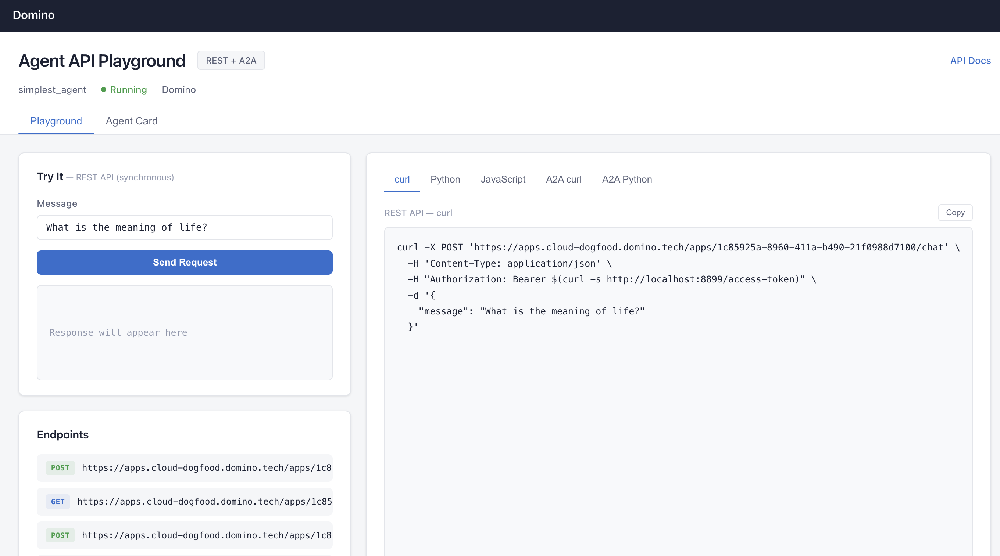
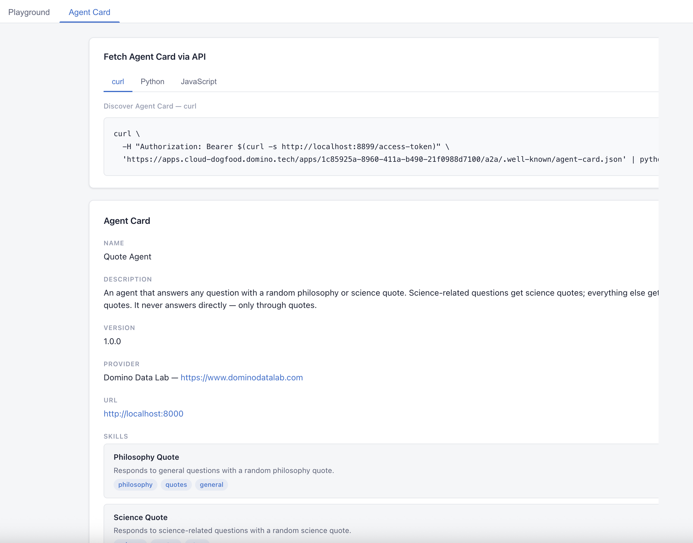

# Simple Agent API

A pydantic_ai agent deployed as a hybrid REST + [A2A (Agent-to-Agent)](https://google.github.io/A2A/) API, with an interactive playground UI. The agent answers questions with random philosophy or science quotes using tool calls.

## Quick Start

### Run as a Domino App

Point the Domino App at `app.sh` — it installs dependencies and starts the server:

```bash
#!/bin/bash
PORT=8888
python chat_app.py --debug --port $PORT
```

Once published, the App URL is your API base URL for all the examples below.

### Run as a Domino Agent

This project can also be deployed as a **Domino Agent**, which adds production tracing, scheduled evaluations, and the ability to deploy directly from a validated experiment run. See the Domino docs: [Deploy agentic systems](https://docs.dominodatalab.com/en/cloud/user_guide/5aedde/deploy-agentic-systems/).

### Run locally (outside Domino)

```bash
pip install -r requirements.txt
python chat_app.py --port 8888 --debug
```

No bearer token is needed when running locally — just use `http://localhost:8888`.

### API Playground

Once running, visit the root URL to open the **API Playground** — it auto-detects the host/port and shows copy-paste sample code for every endpoint (including the bearer token when running in Domino).





## Endpoints

| Method | Path | Purpose |
|--------|------|---------|
| `POST` | `/chat` | REST API — send a message, get a response |
| `GET` | `/health` | Health check |
| `POST` | `/a2a/` | A2A protocol (`message/send`, JSON-RPC 2.0) |
| `GET` | `/a2a/.well-known/agent-card.json` | A2A Agent Card (capability discovery) |
| `GET` | `/docs` | OpenAPI / Swagger interactive docs |
| `GET` | `/` | API Playground UI |

### Authentication in Domino

When deployed as a Domino App, every API request needs a bearer token in the `Authorization` header. Inside any Domino workspace, notebook, or app, a short-lived token is available from a local endpoint:

```
http://localhost:8899/access-token
```

In **curl** you can inline this with command substitution — one copyable command, no extra steps:

```bash
-H "Authorization: Bearer $(curl -s http://localhost:8899/access-token)"
```

In **Python**:

```python
import requests
token = requests.get("http://localhost:8899/access-token").text
headers = {"Authorization": f"Bearer {token}"}
```

The token rotates every few minutes. Fetch a fresh one before each call (or batch of calls).

> **Local testing:** When running outside Domino (`python chat_app.py --port 8888`), no auth is needed — skip the `Authorization` header and use `http://localhost:8888` as the URL.

All samples below use `$APP_URL` as a placeholder. Replace it with your Domino App URL (visible on the App's overview page), e.g. `https://your-domino-host.com/app/quote-agent`.

---

## Using the REST API

The `/chat` endpoint accepts a JSON body and returns the agent's response. Any HTTP client can call it.

### curl

```bash
APP_URL="https://your-domino-host.com/app/quote-agent"

curl -X POST "$APP_URL/chat" \
  -H 'Content-Type: application/json' \
  -H "Authorization: Bearer $(curl -s http://localhost:8899/access-token)" \
  -d '{"message": "What is the meaning of life?"}'
```

Response:

```json
{
  "response": "The unexamined life is not worth living. — Socrates",
  "conversation_id": "140234866205"
}
```

### Python

```python
import requests

APP_URL = "https://your-domino-host.com/app/quote-agent"
TOKEN = requests.get("http://localhost:8899/access-token").text

resp = requests.post(
    f"{APP_URL}/chat",
    headers={"Authorization": f"Bearer {TOKEN}"},
    json={"message": "What is the meaning of life?"}
)
print(resp.json()["response"])
```

### JavaScript

```javascript
const APP_URL = 'https://your-domino-host.com/app/quote-agent';
const token = await fetch('http://localhost:8899/access-token').then(r => r.text());

const res = await fetch(`${APP_URL}/chat`, {
    method: 'POST',
    headers: {
        'Content-Type': 'application/json',
        'Authorization': `Bearer ${token}`
    },
    body: JSON.stringify({ message: 'What is the meaning of life?' })
});
const data = await res.json();
console.log(data.response);
```

---

## Using the A2A Protocol

The [Agent-to-Agent (A2A) Protocol](https://google.github.io/A2A/) is an open standard from Google for inter-agent communication. This agent exposes an A2A-compliant endpoint at `/a2a` so other agents — built with any framework — can discover and talk to it.

### How A2A works

1. **Discovery** — A client fetches the **Agent Card** at `/.well-known/agent-card.json` to learn the agent's name, capabilities, and supported methods.
2. **Message Send** — The client sends a JSON-RPC 2.0 request with `method: "message/send"` containing a user message.
3. **Response** — The server returns either a direct message or a task object with artifacts and conversation history.
4. **Conversation continuity** — Subsequent messages can include the same `context_id` to continue a conversation thread.

### Discover the Agent Card

```bash
APP_URL="https://your-domino-host.com/app/quote-agent"

curl -H "Authorization: Bearer $(curl -s http://localhost:8899/access-token)" \
  "$APP_URL/a2a/.well-known/agent-card.json"
```

### Send a message via A2A (curl)

```bash
APP_URL="https://your-domino-host.com/app/quote-agent"

curl -X POST "$APP_URL/a2a/" \
  -H 'Content-Type: application/json' \
  -H "Authorization: Bearer $(curl -s http://localhost:8899/access-token)" \
  -d '{
    "jsonrpc": "2.0",
    "id": 1,
    "method": "message/send",
    "params": {
      "message": {
        "kind": "message",
        "role": "user",
        "parts": [
          { "kind": "text", "text": "What is the meaning of life?" }
        ],
        "messageId": "msg-001"
      }
    }
  }'
```

### Send a message via A2A (Python — a2a-sdk)

```bash
pip install a2a-sdk
```

```python
import asyncio
import httpx
import requests as req_lib
from uuid import uuid4
from a2a.client import A2ACardResolver, A2AClient
from a2a.types import MessageSendParams, SendMessageRequest

APP_URL = "https://your-domino-host.com/app/quote-agent"
TOKEN_URL = "http://localhost:8899/access-token"


async def main():
    token = req_lib.get(TOKEN_URL).text

    async with httpx.AsyncClient(
        headers={"Authorization": f"Bearer {token}"}
    ) as httpx_client:
        # 1. Discover the agent card
        resolver = A2ACardResolver(
            httpx_client=httpx_client,
            base_url=f"{APP_URL}/a2a",
        )
        agent_card = await resolver.get_agent_card()
        print(f"Agent: {agent_card.name}")

        # 2. Create the A2A client
        client = A2AClient(
            httpx_client=httpx_client,
            agent_card=agent_card,
        )

        # 3. Send a message
        request = SendMessageRequest(
            id=str(uuid4()),
            params=MessageSendParams(
                message={
                    "kind": "message",
                    "role": "user",
                    "parts": [
                        {"kind": "text", "text": "What is the meaning of life?"}
                    ],
                    "messageId": uuid4().hex,
                }
            ),
        )
        response = await client.send_message(request)
        print(response.model_dump(mode="json", exclude_none=True))


asyncio.run(main())
```

### Multi-agent scenario

In a multi-agent system, an orchestrator agent can discover and call this agent at runtime. Since both agents run as Domino Apps, the caller fetches a token and passes it via the httpx client:

```python
import requests as req_lib

AGENT_URL = "https://your-domino-host.com/app/philosophy-agent"
token = req_lib.get("http://localhost:8899/access-token").text

async with httpx.AsyncClient(
    headers={"Authorization": f"Bearer {token}"}
) as httpx_client:
    resolver = A2ACardResolver(httpx_client=httpx_client, base_url=f"{AGENT_URL}/a2a")
    card = await resolver.get_agent_card()

    # The card describes the agent's capabilities — the orchestrator can
    # inspect card.name, card.description, card.skills, etc. to decide
    # whether this agent is the right one for the current task.

    client = A2AClient(httpx_client=httpx_client, agent_card=card)
    response = await client.send_message(request)

    # Use context_id from the response to continue the conversation
    context_id = response.result.context_id
```

Each agent is a separate Domino App with its own A2A endpoint. They don't need to share code, frameworks, or even languages — the A2A protocol handles the interop.

---

## Project Structure

| File | Purpose |
|------|---------|
| `simplest_agent.py` | Agent definition — model setup, tools, system prompt |
| `chat_app.py` | FastAPI server — REST API, A2A mount, playground UI |
| `app.sh` | Domino App entry point |
| `ai_system_config.yaml` | Model selection, prompts, and agent parameters |
| `evaluation_library.py` | Evaluation metrics library (toxicity, relevancy, accuracy) |
| `dev_eval_simplest_agent.py` | Dev-time batch evaluation against `sample_questions.csv` |
| `prod_eval_simplest_agent.py` | Production evaluation of deployed agent traces |
| `static/` | API Playground UI (HTML/CSS/JS) |

## Configuration

Edit `ai_system_config.yaml` to switch models. Two provider modes are supported:

**vLLM (Domino-hosted model)** — Uses a local OpenAI-compatible endpoint with rotating auth tokens. The `base_url` and `token_url` fields configure the endpoint and token refresh.

**OpenAI (external API)** — Uses the `OPENAI_API_KEY` environment variable. No `base_url` or `token_url` needed — just uncomment the OpenAI block and comment out the vLLM block.

## Evaluation

```bash
# Dev evaluation — runs agent against sample_questions.csv and logs traces
python dev_eval_simplest_agent.py

# Production evaluation — scores traces from the deployed agent
# Edit AGENT_ID and VERSION in the file first
python prod_eval_simplest_agent.py
```

## Environment Setup (Domino)

The Domino container image needs these packages:

```dockerfile
RUN pip install -r requirements.txt
```

Or manually:

```dockerfile
RUN pip install pydantic-ai fasta2a fastapi uvicorn httpx requests pydantic PyYAML
RUN pip install dominodatalab[agents]
```

---

## Home Grown Agent Registry Recipe

When you have multiple A2A agents running, you need a way for them to find each other. The A2A protocol defines agent cards for capability discovery, but it assumes you already know the agent's URL. A registry fills that gap — agents register themselves on startup, and other agents query the registry to discover peers at runtime.

### The registry: `a2a-registry`

[a2a-registry](https://github.com/allenday/a2a-registry) is an open-source, pip-installable service that does exactly this. Run it as its own Domino App.

**Install:**

```bash
pip install a2a-registry
```

**Start the server (Domino `app.sh`):**

```bash
a2a-registry serve --host 0.0.0.0 --port 8080
```

That gives you:

| Method | Path | Purpose |
|--------|------|---------|
| `POST` | `/agents` | Register an agent (pass its agent card) |
| `GET` | `/agents` | List all registered agents |
| `POST` | `/agents/search` | Search agents by keyword |
| `GET` | `/health` | Health check |

### Self-registering an agent on startup

Add this to any agent's startup code (e.g. in `chat_app.py` alongside the lifespan) so it announces itself to the registry every time it boots. The `url` in the agent card should be the Domino App URL where this agent is reachable by other apps:

```python
import os
import requests

REGISTRY_URL = os.environ.get("A2A_REGISTRY_URL", "https://your-domino-host.com/app/a2a-registry")
TOKEN_URL = "http://localhost:8899/access-token"
SELF_URL = os.environ.get("SELF_APP_URL", "https://your-domino-host.com/app/quote-agent")

def _domino_auth_headers():
    if os.environ.get("DOMINO_API_HOST"):
        token = requests.get(TOKEN_URL).text
        return {"Authorization": f"Bearer {token}"}
    return {}

def register_with_registry():
    """Best-effort self-registration — non-fatal if registry is down."""
    try:
        requests.post(
            f"{REGISTRY_URL}/agents",
            headers=_domino_auth_headers(),
            json={
                "agent_card": {
                    "name": "Quote Agent",
                    "description": "Answers questions with philosophy/science quotes",
                    "url": f"{SELF_URL}/a2a",
                    "version": "1.0.0",
                    "protocol_version": "0.3.0",
                    "capabilities": {"streaming": False, "push_notifications": False},
                    "default_input_modes": ["text"],
                    "default_output_modes": ["text"],
                    "skills": [
                        {"id": "philosophy-quote", "description": "Random philosophy quote"},
                        {"id": "science-quote", "description": "Random science quote"},
                    ],
                }
            },
            timeout=5,
        )
    except Exception:
        pass  # registry might not be up yet — that's fine
```

### Wiring it into a pydantic-ai orchestrator agent

The real payoff is an orchestrator agent that can discover and call other agents as tools. Here's a self-contained example — the LLM decides *which* agent to use based on what the registry returns:

```python
import asyncio
import os
import httpx
import requests as req_lib
from uuid import uuid4
from pydantic_ai import Agent, RunContext
from a2a.client import A2ACardResolver, A2AClient
from a2a.types import MessageSendParams, SendMessageRequest

REGISTRY_URL = os.environ.get(
    "A2A_REGISTRY_URL", "https://your-domino-host.com/app/a2a-registry"
)
TOKEN_URL = "http://localhost:8899/access-token"


def _domino_headers():
    """Fetch a fresh Domino bearer token (skip if running locally)."""
    if os.environ.get("DOMINO_API_HOST"):
        token = req_lib.get(TOKEN_URL).text
        return {"Authorization": f"Bearer {token}"}
    return {}


def list_available_agents(ctx: RunContext[str]) -> str:
    """
    Query the agent registry and return a summary of all available agents
    and their skills. Use this to decide which agent to delegate to.
    """
    resp = req_lib.get(
        f"{REGISTRY_URL}/agents", headers=_domino_headers(), timeout=5,
    )
    agents = resp.json()
    lines = []
    for entry in agents:
        card = entry.get("agent_card", entry)
        skills = ", ".join(s.get("id", "") for s in card.get("skills", []))
        lines.append(f"- {card['name']} @ {card['url']}  skills: {skills}")
    return "\n".join(lines) or "No agents registered."


def search_agents(ctx: RunContext[str], query: str) -> str:
    """
    Search the registry for agents matching a keyword.
    Returns names, URLs, and skill summaries.
    """
    resp = req_lib.post(
        f"{REGISTRY_URL}/agents/search",
        headers=_domino_headers(),
        json={"query": query},
        timeout=5,
    )
    results = resp.json()
    lines = []
    for entry in results:
        card = entry.get("agent_card", entry)
        lines.append(f"- {card['name']} @ {card['url']}: {card.get('description', '')}")
    return "\n".join(lines) or "No matching agents found."


async def call_a2a_agent(ctx: RunContext[str], agent_url: str, message: str) -> str:
    """
    Send a message to a remote A2A agent and return its response.
    agent_url is the full A2A base URL from the registry
    (e.g. https://your-domino-host.com/app/quote-agent/a2a).
    """
    async with httpx.AsyncClient(headers=_domino_headers()) as client:
        resolver = A2ACardResolver(httpx_client=client, base_url=agent_url)
        card = await resolver.get_agent_card()
        a2a = A2AClient(httpx_client=client, agent_card=card)

        resp = await a2a.send_message(SendMessageRequest(
            id=str(uuid4()),
            params=MessageSendParams(message={
                "kind": "message",
                "role": "user",
                "parts": [{"kind": "text", "text": message}],
                "messageId": uuid4().hex,
            }),
        ))
        task = resp.result

        while task.status.state in ("submitted", "working"):
            await asyncio.sleep(1)
            from a2a.types import GetTaskRequest, GetTaskParams
            get_resp = await a2a.get_task(GetTaskRequest(
                id=str(uuid4()),
                params=GetTaskParams(id=task.id),
            ))
            task = get_resp.result

        if task.artifacts:
            return task.artifacts[0].parts[0].text
        return f"Agent finished with state: {task.status.state}"


orchestrator = Agent(
    "openai:gpt-4.1-mini",
    instructions=(
        "You are an orchestrator. When the user asks a question, first check "
        "the registry for available agents, pick the best one, then delegate "
        "the question to it via call_a2a_agent. Return the agent's answer."
    ),
)
orchestrator.tool(list_available_agents)
orchestrator.tool(search_agents)
orchestrator.tool(call_a2a_agent)
```

The orchestrator LLM sees the three tools, decides to call `list_available_agents` or `search_agents` first, picks the right `agent_url` from the results, then calls `call_a2a_agent` with the user's question. No hardcoded URLs in the prompt — it figures it out from the registry at runtime. The `_domino_headers()` helper fetches a fresh bearer token for each call when running in Domino, and is a no-op when running locally.

### Architecture at a glance

```
┌──────────────────┐       ┌──────────────────┐
│  Registry        │◄──────│  Quote Agent     │  (self-registers on boot)
│  Domino App      │       │  Domino App      │
│  /app/registry   │       │  /app/quote-agent│
└────────┬─────────┘       └──────────────────┘
         │
         │  GET /agents  (+ bearer token)
         ▼
┌──────────────────┐       ┌──────────────────┐
│  Orchestrator    │──────►│  Any A2A Agent   │
│  Agent           │ A2A   │  (discovered     │
│  Domino App      │  +auth│   via registry)  │
└──────────────────┘       └──────────────────┘
```

Each box is a separate Domino App. The registry is the only piece agents need to know the URL of — everything else is discovered. All inter-app calls include the bearer token from `localhost:8899`.
